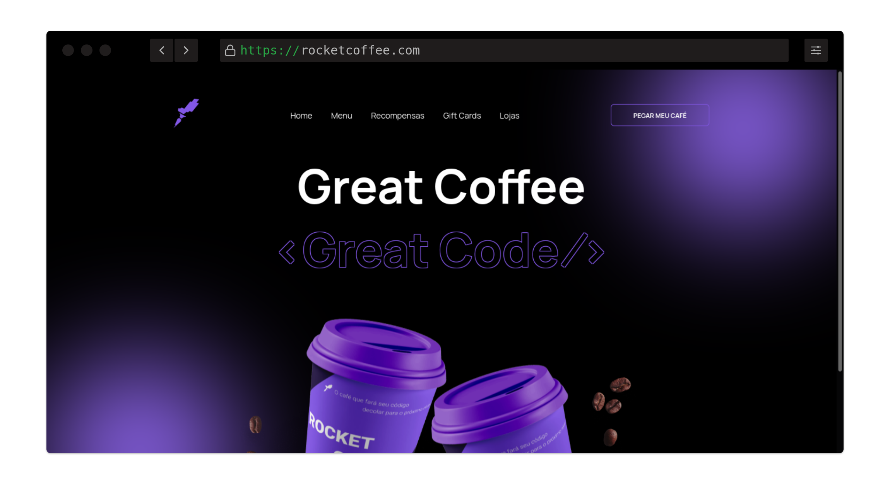

<h1 align="center"> Rocket Coffee</h1>

## 💻 Projeto

Neste desafio você deverá desenvolver uma homepage para uma marca de café.

### Layout

## 🚀 **Techs**

- HTML
- CSS
- JavaScript

## ✅ **Requisitos**

Neste desafio você vai construir uma homepage para uma marca de café*.* Caso você ainda não tenha feito os cursos do Discover ou queira fazer uma revisão, segue abaixo uma lista dos cursos e documentações que podem te ajudar a resolver este desafio.

- [O guia estelar de HTML](https://app.rocketseat.com.br/node/o-guia-estelar-de-html)
- [O guia estelar de CSS](https://app.rocketseat.com.br/node/o-guia-estelar-de-css)
- [Posicionando foguetes](https://app.rocketseat.com.br/node/posicionando-foguetes)
- [Formulários de outro planeta](https://app.rocketseat.com.br/node/formularios-de-outro-planeta)
- [Alinhando os planetas](https://app.rocketseat.com.br/node/flexbox)
- [App bonito, até nos textos](https://app.rocketseat.com.br/node/flexbox)
- [O Guia Estelar de JavaScript](https://app.rocketseat.com.br/node/o-guia-estelar-de-java-script)
- [Pilotando com a DOM](https://app.rocketseat.com.br/node/pilotando-com-a-dom)

**Requisitos para o desafio:**

- Seguir o layout do Figma.
- Deixar o layout responsivo conforme o Figma ✅.
- Na versão mobile, ao clicar no menu hamburger deverá exibir um menu responsivo ✅.
- Adicionar `hover` nos botões.
